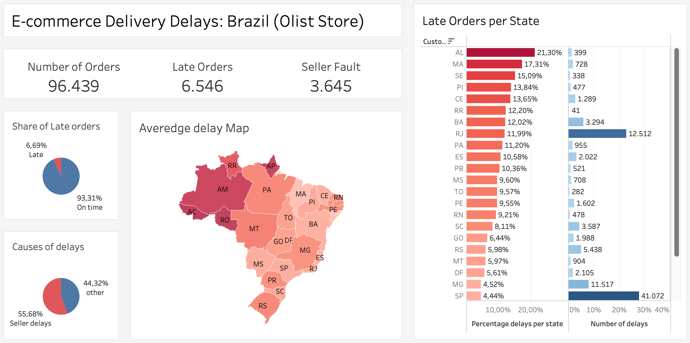
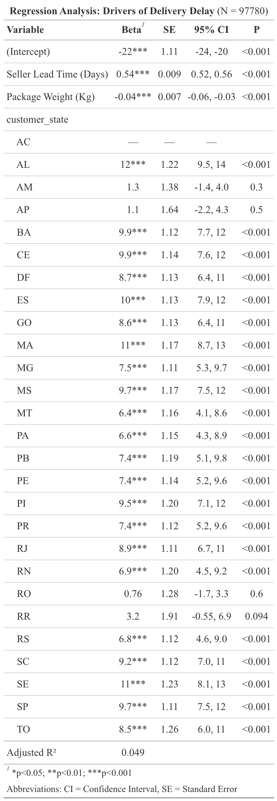

# Olist Supply Chain Analysis: Unmasking Delivery Delays

### Business Problem & Objective
In the e-commerce sector, on-time delivery is the primary driver of customer satisfaction. This project analyzes the **Olist E-commerce dataset** (Brazilian marketplace) to answer a critical business question:

> *"Are delivery delays caused by structural logistics inefficiencies (carriers) or by the sellers' slowness in preparing orders?"*

The goal was to isolate the root causes of delays and identify specific actionable areas for improvement.

---

### Dashboard Overview

**Here to view the Interactive Dashboard on Tableau Public:[https://public.tableau.com/views/Book2_17701285198890/Dashboard1?:language=it-IT&:sid=&:redirect=auth&:display_count=n&:origin=viz_share_link]**

---

### Key Findings
By combining **SQL** for data extraction and **R** for statistical modeling, the analysis revealed:

* **Sellers are the Main Bottleneck:** Approximately **55.68%** of all delayed orders were flagged as "Seller Fault." These sellers took significantly longer than the standard benchmark to hand over the package to the carrier, effectively causing the delay before the logistics process even began.
* **Critical Geographical Disparities:** The state of **Alagoas (AL)** suffers from the highest delay rate (**21.30%**). The regression model confirms that simply shipping to this state adds an average of **~12 days** to the delivery time compared to the baseline.
* **High Performance Baseline:** Despite these outliers, the overall logistics network is robust, with **93.31%** of orders delivered on time.

---

### Statistical Evidence (Regression Analysis)
To validate the findings, a Linear Regression model was run in R (`lm`) to measure the impact of variables on the Delivery Gap.

**Interpretation:**
* **Seller Lead Time ($\beta$ = 0.54):** For every extra day a seller waits to ship, the final delivery is delayed by 0.54 days (statistically significant at 99%).
* **Package Weight:** Heavier packages have a slight but significant negative impact on delivery speed.

---

### Project Structure & Methodology

The project follows a full data analysis pipeline:

1.  **`1_SQL`**:
    * Raw data extraction from the Olist database.
    * Feature Engineering: Created `Seller_rank` (Time from Approval $\to$ Carrier) and `Delivery_gap` (Actual vs. Estimated Date).
    * Data granularity management to handle empty timestamps.

2.  **`2_R_Analysis`**:
    * **Data Cleaning:** Removed outliers and handled missing values using `tidyverse`.
    * **Modeling:** Implemented a Multivariate Linear Regression to predict delays based on state, weight, and seller rank.
    * **Logic Creation:** Defined the "Seller Fault" flag by comparing individual seller times against the average performance of on-time orders.

3.  **`3_Images`**:
    * Contains the assets used for this documentation (Dashboard screenshots and Statistical tables).

---

### Tech Stack
* **SQL (PostgreSQL):** Data Manipulation & Extraction.
* **R (Tidyverse, Stargazer, ggplot2):** Statistical Analysis & Modeling.
* **Tableau:** Data Visualization & Storytelling.

---

### Contact
* **Author:** Andrea Fulignati
* **LinkedIn:** [https://www.linkedin.com/in/andreafulignati/]
